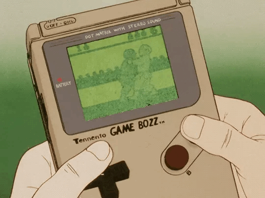
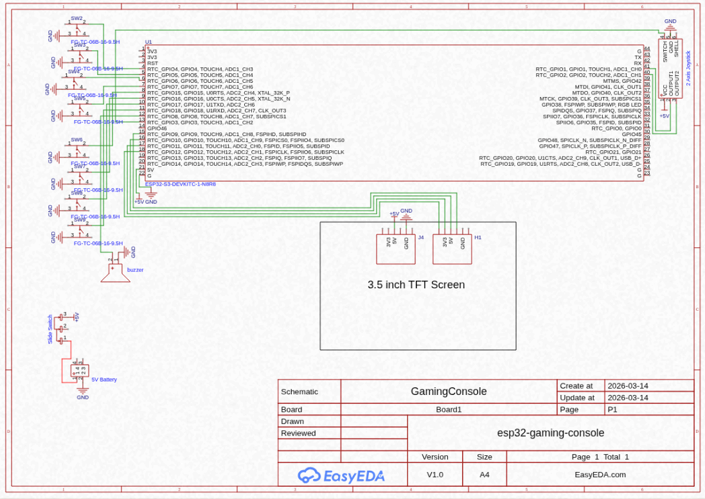
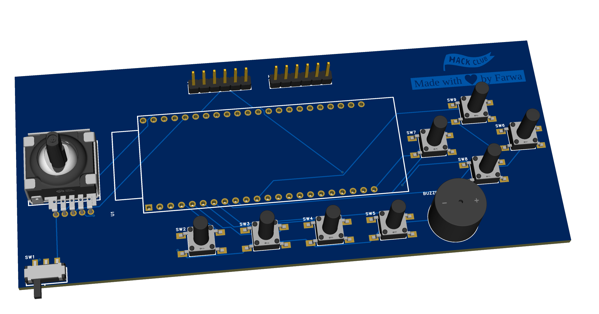

# Retro Handled Gaming Console

##Introduction
Hello!! I am Farwa Zafar in 9 grade and i am 14 years old from pakistan I am building an amazing project called retro handled Gaming console using EsP32-S3 , TFT display , four buttons for slecting menu and four for the gaming control , joystick for movement . In this project 
you will be able to play 5 to 6 old classic games

---

## Features Of My Project
1. ESP32-S3 : The main controller that controls the device (Like brain of the console)
2. TFT Display : Shows the Graphics and UI
3. Joystick : Used for selecting menus, choosing games and for play games

---

## Failures And Realization
When I added the products to the list it was time to design the scematic of the project. First I designed it on the paper page but after sometime I realized hat I made a mistake like I added a poweer bank but why would i need power bank when I am already using the battery
I spent at least 2 hours on it cause it was my first time. When I tried to fiz it I even messed up more then I realized that I should make it digital because now I know my mistakes and also when I ws making my PCB Design i really got stuck up many times but at the end I 
finnaly complete it

---

## Why I Made This Project?
I really love the 90's American era it is very nostalgic. I got the idea from the Stasis tiers project then I thought why should not I make a device like the ones i watch in 90's movies? It gives good vibes and also it is very simple to play

---

## Materials & Bill of Materials (BOM)
In this project the following hardware components are needed:

|Components|Description|Quantity|Price|
|:---|:---|:---|:---|
|ESP32-S2|Main Controller|1|$5.72|
|3.5 inch TFT Display|For graphics|1|$10.01|
|Push Buttons|For game controls|8|$0.14|
|Joystick|For movement|1|$0.64|
|Switch|On/Off power button|1|$0.04|
|Buzzer|for game sounds|1|$0.11|
|Battery|power source|1|$1.97|
|Booste Converter|J5019 3.7V to 5V/9V Adjustable|1|$0.50|
|Veroboard|for soldering|1|$1.07|
|Jumper Wires|for connections|1|$0.16|
|Resistors|for safety|8|$0.06|
|Other|PCB|

---

## Circuit Scematic
Here is the digital scemtic of my device:

---

## Design & #D Model
Here is the visual design of my Gaming Console:

---

## Special Thanks
I want to say hge thank you to:
Hack Club and Stasis team: For providing this amazing platform to high schoolers like me to build and learn the electrons and hardware
My Friend Chika: For helping me to understand the README requirements and guiding me through the submission process
The Open Source Community: For the amazing libraries that made this ESP32-S3 console possible to work

---

Made with ❤️ by Farwa Zafar
