# Retro Handled Gaming Console 🎮

**Introduction:**

Hello!! I am Farwa Zafar in 9 grade and i am 14 years old from pakistan I am building an amazing project called retro handled Gaming console using EsP32-S3 , TFT display , four buttons for the gaming control and selecting menu , joystick for movement and buzzer for sound, and lithium batter which will charge the console so you dont need to connect it to usb everytime and best part is that you can recharge it. In this project you will be able to play 6 old games

---

## Features Of My Project
1. **ESP32-S3:** The main controller that controls the device(like the brain)
2. **TFT Display:** Shows the Graphics and UI
3. **Joystick:** Used for selecting menus, choosing games and for play games
4. **Charges:** It can be charged and also you dont need to connect the usb everytime
5. **Buzzer Sound:**When using it the buzzer makes sound so it will improve the experience to use it

---
## My Console
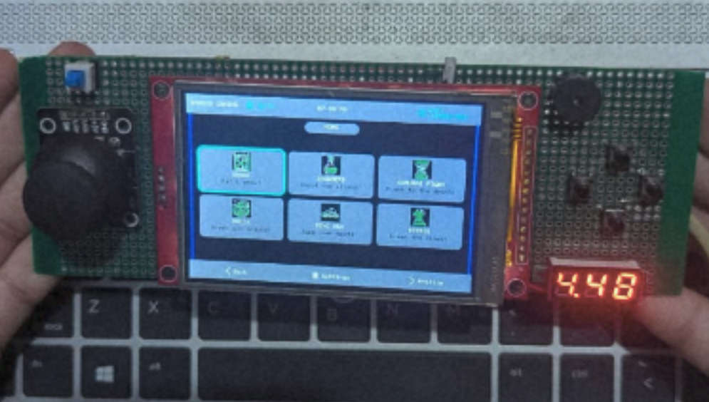
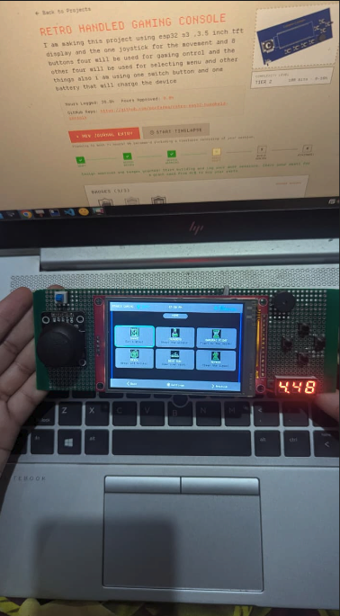
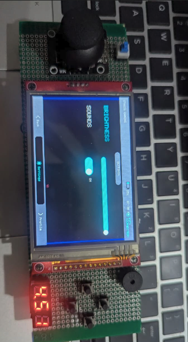
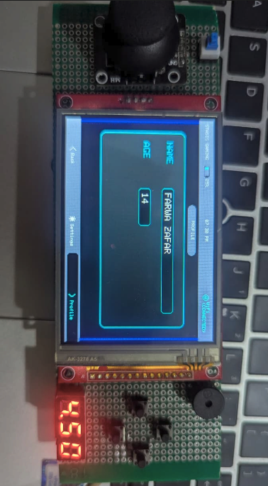

---
### You cn see my whole console here:
https://www.youtube.com/watch?v=nXrI39w5yM0

https://www.youtube.com/watch?v=yK53IvrvP9o
---

## Failures And Realization
When I added the products to the list it was time to design the scematic of the project First I designed it on the paper page but after sometime I realized hat I made a mistake like I added a poweer bank but why would i need power bank when I am already using the battery
I spent at least 2 hours on it cause it was my first time. When I tried to fiz it I even messed up more then I realized that I should make it digital because now I know my mistakes and also when I ws making my PCB Design i really got stuck up many times but at the end I 
finnaly complete it.
After getting the PCB I see that i made mistke as it was my first time using pcb and designing it i made mistakee and the components
did not fit there . PCB have issue. then i realized that i should make it on veroboard.
and also i even dont be able to put the video in my stasis journel i tried every methods but i cant be able to put the video.
and also i tried to put the video into readme but still its not working then i think that why should i not put that video into youtube
and then just put that video link into readme and journel

---

## Why I Made This Project?
I really love the 90's American era it is very nostalgic. I got the idea from the Stasis tiers project then I thought why should not I make a device like the ones i watch in 90's movies? It gives good vibes and also it is very simple to play

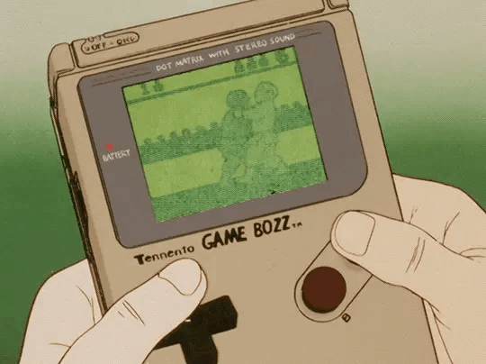

---

## Circuit Scematic
Here is the digital scemtic of my device:

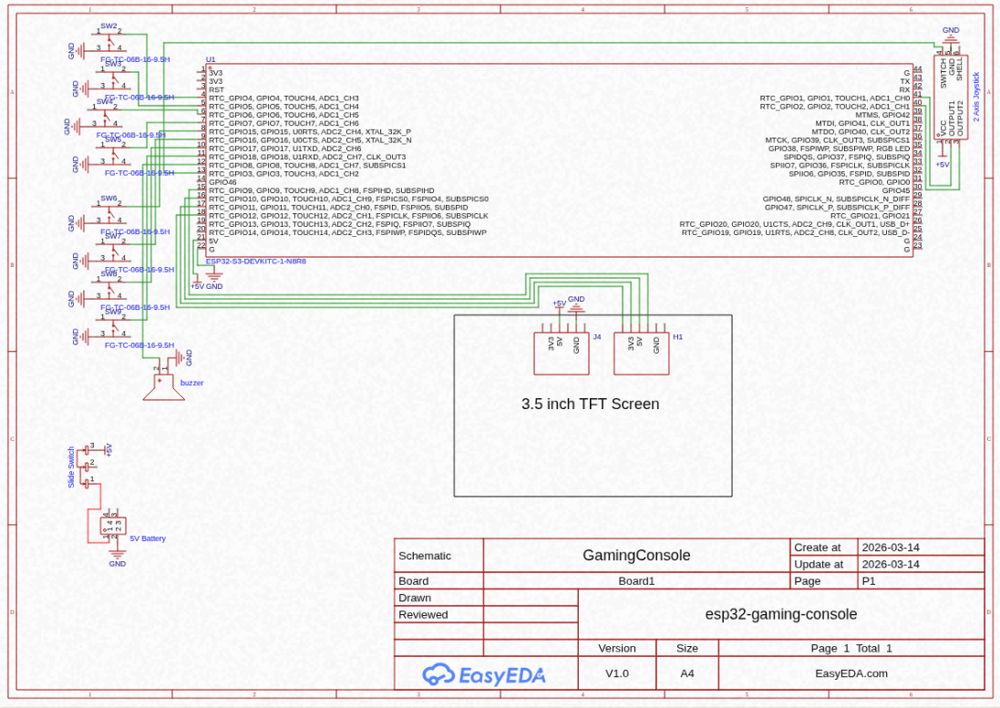

---

## Design & 3D Model
Here is the visual design of my Gaming Console:

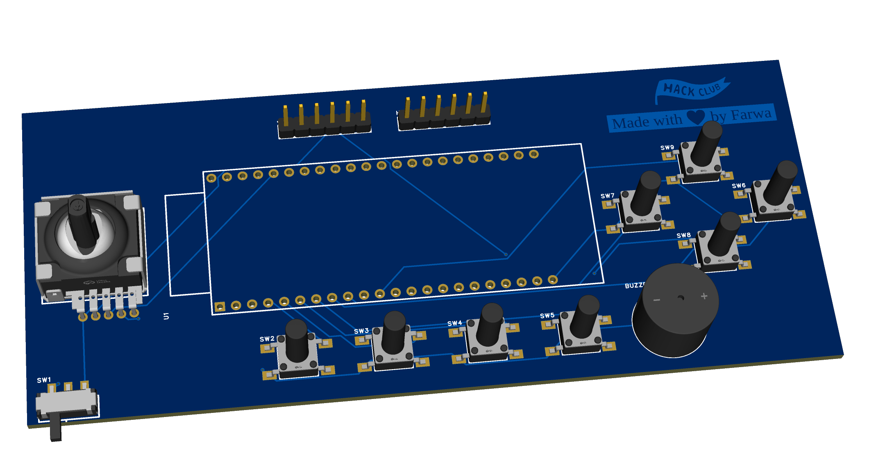

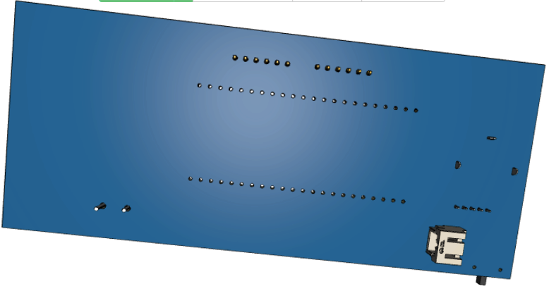
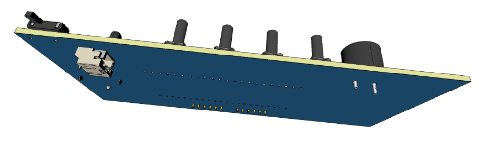
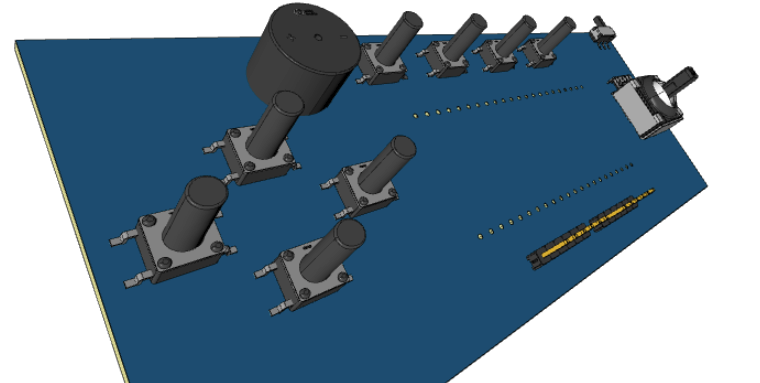

### Here is the My PCB that I not make correct
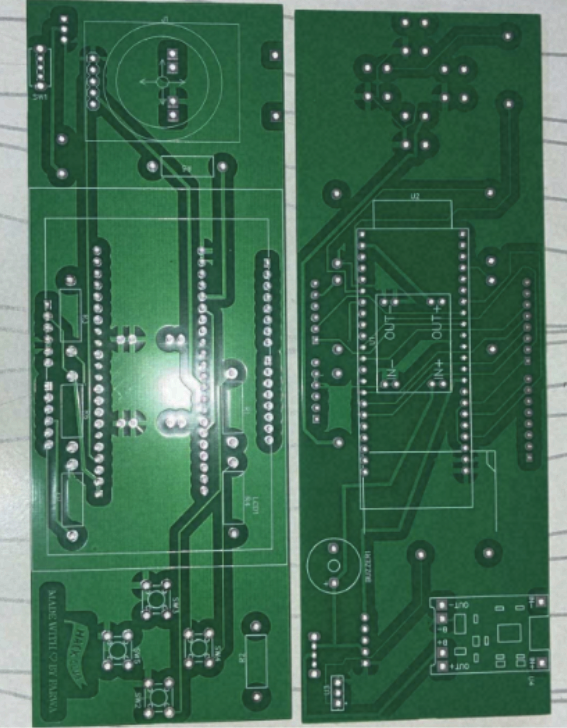

---

## Special Thanks
I want to say hge thank you to:

**Hack Club and Stasis team:** For providing this amazing platform to high schoolers like me to build and learn the electrons and hardware

**My Friend Chika:** For helping me to understand the README requirements and guiding me through the submission process

**The Open Source Community:** For the amazing libraries that made this ESP32-S3 console possible to work

---
## Materials & Bill of Materials (BOM)
In this project the following hardware components are needed:

|Components|Description|Quantity|Price|
|:---|:---|:---|:---|
|ESP32-S2|Main Controller|1|$5.72|
|3.5 inch TFT Display|For graphics|1|$10.01|
|Push Buttons|For game controls|8|$0.14|
|Joystick|For movement|1|$0.64|
|Switch|On/Off power button|1|$0.04|
|Buzzer|for game sounds|1|$0.11|
|Battery|power source|1|$1.97|
|Booste Converter|J5019 3.7V to 5V/9V Adjustable|1|$0.50|
|Veroboard|for soldering|1|$1.07|
|Jumper Wires|for connections|1|$0.16|
|Resistors|for safety|8|$0.06|
|Other|PCB|

---

Made with ❤️ by Farwa Zafar
